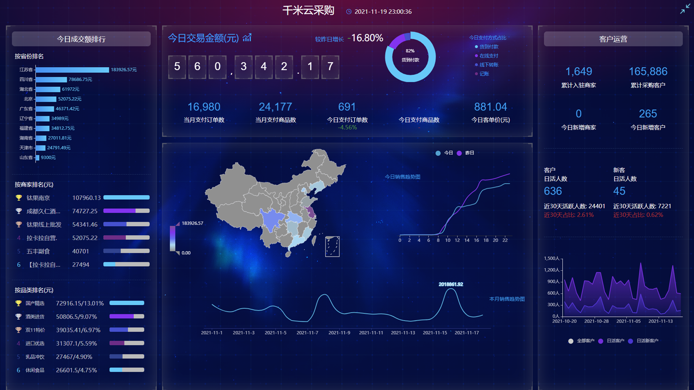
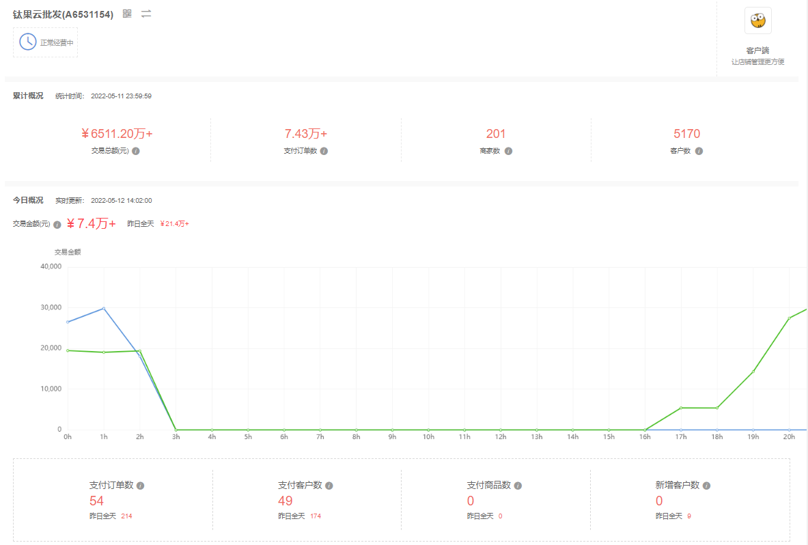
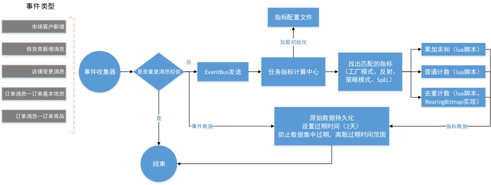

# realtime_statistics
基于**redis**和**lua**脚本实现的电商实时数据大屏、管理后台概况页等统计指标数据

### 1.效果图
#### 数据大屏

#### 概况页

### 2.数据大屏实时指标功能图

## [3.RoaringBitmap原理](https://cloud.tencent.com/developer/article/1136054)
*[不用找了，roaringBitMap原理看这个就行了](https://zhuanlan.zhihu.com/p/351365841)*  
1.首先，将 32bit int（无符号的）类型数据 划分为 2^16 个桶（即使用数据的前16位二进制作为桶的编号），每个桶有一个Container（可以理解为容器也可以理解为这个桶，容器和桶在这里可以理解为一个东西，只是说法不一样而已） 来存放一个数值的低16位。  
2.在存储和查询数值时，将数值 k 划分为高 16 位和低 16 位，取高 16 位值找到对应的桶，然后在将低 16 位值存放在相应的 Container 中。

### 结论
采用压缩算法后的bitmap, 内存占用比Key-value缩减100倍, 比Redis自带的bitmap(密集型的)缩减10倍;
由于RoaringBitmap中容器的不同, 包括offset的稀散性, 还是比理想的连续整型offset大了约20倍内存
大家可以测试一下2kw, 3kw数据, 数据越多, offset离散区间越小, 所取得的压缩效果也会更好